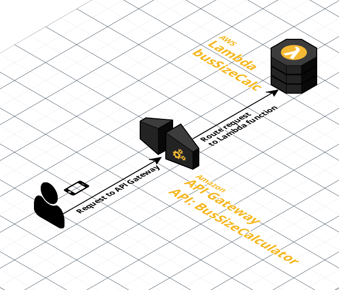

# Determinar los tamaños de bus según grupos

El problema plantea la necesidad de encontrar todos los posibles tamaños de un bus que puede llevar a todos los grupos de amigos de manera simultánea, sin que ninguno de los grupos se separe, y cumpliendo con la capacidad máxima del autobús.

Para resolver este problema, se propone una función AWS Lambda, que recibe como entrada un arreglo de números separados por comas que representan el tamaño de cada grupo de amigos y devuelve un arreglo con todos los posibles tamaños del bus que pueden transportar a todos los grupos de amigos, cumpliendo con las restricciones mencionadas.

<br>


- [Determinar los tamaños de bus según grupos](#determinar-los-tamaños-de-bus-según-grupos)
  - [1. Descripción general](#1-descripción-general)
  - [2. Arquitectura de la solución](#2-arquitectura-de-la-solución)
  - [3. Documentación de Postman](#3-documentación-de-postman)
  - [4. Endpoint y parámetros](#4-endpoint-y-parámetros)
  - [5. Explicación detallada de la función](#5-explicación-detallada-de-la-función)
  - [6. Como llegué a la solución](#6-como-llegué-a-la-solución)
    - [6.1 Razonamiento](#61-razonamiento)
    - [6.2 Implementación](#62-implementación)

<br>


---

## 1. Descripción general
La solución presentada en el archivo index.mjs se basa en un algoritmo que itera desde 1 hasta la suma total de personas en todos los grupos. En cada iteración, se verifica si la capacidad del bus es divisible por el número total de personas en todos los grupos. Si es así, se realiza una segunda iteración para comprobar si el bus puede llevar a todos los grupos cumpliendo con las restricciones mencionadas.

Si el bus puede llevar a todos los grupos, se agrega el tamaño del bus al arreglo de tamaños de bus posibles. Al final de la iteración, se devuelve el arreglo de tamaños de bus posibles.

La función AWS Lambda está diseñada para ser expuesta como una API REST mediante el servicio AWS API Gateway. El archivo `API_Gateway_swagger_export.json` describe la configuración necesaria para el servicio AWS API Gateway en AWS.

<br>


## 2. Arquitectura de la solución


<br>


## 3. Documentación de Postman
La documentación de la API REST y un ejemplo de cómo usarla en Postman se pueden encontrar en el siguiente enlace:
[https://documenter.getpostman.com/view/26664800/2s93RTSYkF](https://documenter.getpostman.com/view/26664800/2s93RTSYkF)


<br>


## 4. Endpoint y parámetros
**Link base:**
```
https://6mr0zq9t2b.execute-api.us-east-1.amazonaws.com/prod/calculatebus
```

**Parámetros Query**

groups &rarr; un string con la lista de grupos separados por coma (",")

*Nota: No cuenta con autenticación*

<br>

---
## 5. Explicación detallada de la función  

<br>


```
export const handler = async (event) => 
```
Esta es la declaración de la función que será utilizada como handler de la API de AWS Lambda. Recibe un objeto event como entrada y devuelve una respuesta.
  
<br>


```
const groups = event.queryStringParameters.groups.split(",").map(Number);
```
Aquí se obtiene la lista de grupos de amigos a partir de los parámetros de consulta groups, que son enviados en el objeto event. Se separan los elementos por coma (",") y se convierten a números enteros utilizando el método map.

<br>


```
const totalPeople = groups.reduce((a, b) => a + b, 0);
```
Se calcula la cantidad total de personas sumando el tamaño de cada grupo mediante el método reduce.

<br>


```
let sizes = [];
```
Aquí se inicializa el arreglo sizes que contendrá todos los posibles tamaños de bus.

<br>

```
for (let x = 1; x <= totalPeople; x++)
```
Se itera desde 1 hasta la suma total de personas en todos los grupos.

<br>


```
if (totalPeople % x === 0) 
```
Se verifica si el tamaño del bus es divisible por el número total de personas en todos los grupos. Si es así, se realiza una segunda iteración para comprobar si el bus puede llevar a todos los grupos cumpliendo con las restricciones mencionadas.

<br>


```
let bus = 0;
let canTravel = true;
for (let i = 0; i < groups.length; i++) {
    bus += groups[i];
    if (bus > x) {
        canTravel = false;
        break;
    } else if (bus === x) {
        bus = 0;
    }
}
```
Dentro de la iteración anterior, se realiza un segundo bucle que suma el tamaño de cada grupo hasta que se llega al tamaño del bus x. Si el tamaño de la suma de grupos excede el tamaño del bus, se establece canTravel en false y se sale del bucle. Si el tamaño de la suma de grupos es igual al tamaño del bus, se reinicia la variable bus a 0.

<br>


```
if (canTravel && bus === 0) {
    sizes.push(x);
}
```
Si el bus puede llevar a todos los grupos y se ha completado el recorrido sin dejar a ningún grupo en el camino, se agrega el tamaño del bus al arreglo sizes.

<br>


```
const response = {
    statusCode: 200,
    headers: { "Content-Type": "application/json" },
    body: JSON.stringify({ sizes: sizes.join(",") })
};
```
Finalmente, se construye y devuelve la respuesta, que incluye un código de estado HTTP 200, un encabezado de tipo de contenido y un cuerpo que contiene el arreglo sizes convertido en una cadena separada por comas.

<br>


## 6. Como llegué a la solución
<br>

### 6.1 Razonamiento
Primero, se entiende que el tamaño del bus debe ser un divisor del número total de personas para que no haya sillas vacías en el último viaje del bus. Por lo tanto, solo se consideran los valores de x que son divisores del número total de personas.

Luego, se verifica si cada grupo puede viajar en el bus sin separarse y sin cambiar su posición relativa. Para hacer esto, se lleva un registro del número de personas en el bus y se verifica si en algún momento el número de personas en el bus excede x. Si esto sucede, entonces x no es un tamaño válido para el bus.

Finalmente, si todos los grupos pueden viajar con un tamaño de bus de x y no hay sillas vacías en el último viaje del bus, entonces x es un tamaño válido para el bus y se agrega al arreglo de tamaños.

### 6.2 Implementación
La función aplica el proceso deductivo descrito anteriormente para encontrar una solución al problema. Primero, la función toma el parámetro de consulta *“grupos”* del evento y lo divide en un arreglo de números. Luego, calcula el número total de personas sumando todos los elementos del arreglo de grupos.

Después, la función **itera** sobre todos los valores posibles de *x* **desde 1 hasta el número total de personas**. Si el **número total de personas es divisible por x** (es decir, `totalPeople % x === 0` ), entonces se verifica si x es un tamaño válido para el bus. Para hacer esto, se itera sobre cada grupo y se lleva un registro del número de personas en el bus (`bus += groups[i]`). **Si en algún momento el número de personas en el bus excede x (`bus > x`), entonces x no es un tamaño válido** para el bus y se rompe el ciclo (`canTravel = false; break;`). Si el número de personas en el bus es igual a x (`bus === x`), entonces se reinicia el contador del bus a 0 (`bus = 0`).

Si todos los grupos pueden viajar con un tamaño de bus de x y no hay sillas vacías en el último viaje del bus (es decir, `canTravel && bus === 0`), entonces **x** es un tamaño válido para el bus y se agrega al arreglo de tamaños (`sizes.push(x)`).

¡Muchas Gracias!